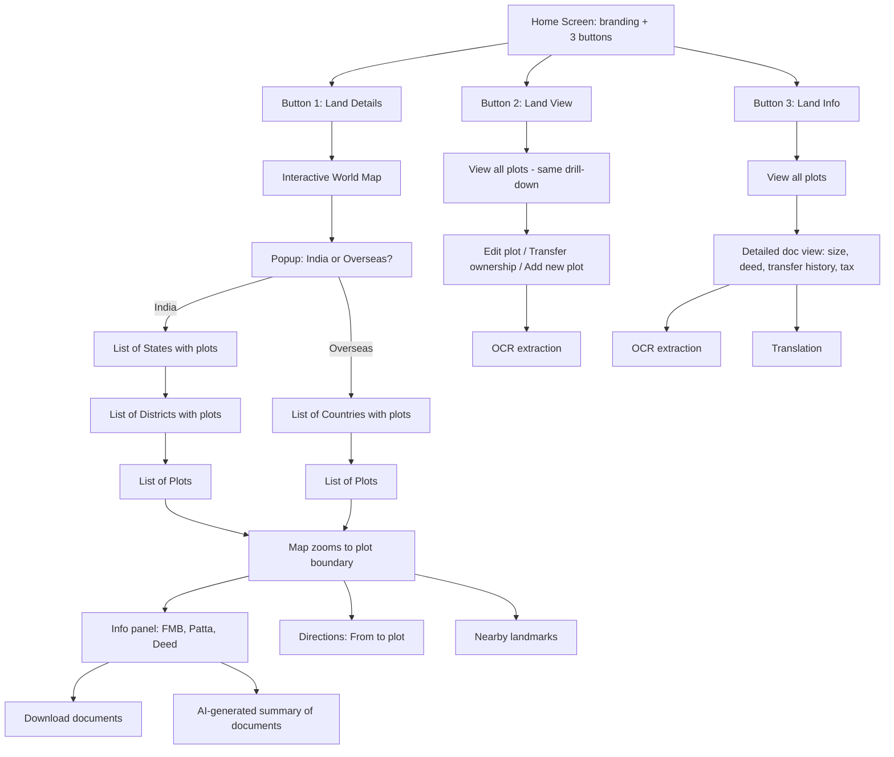
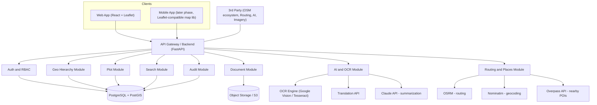
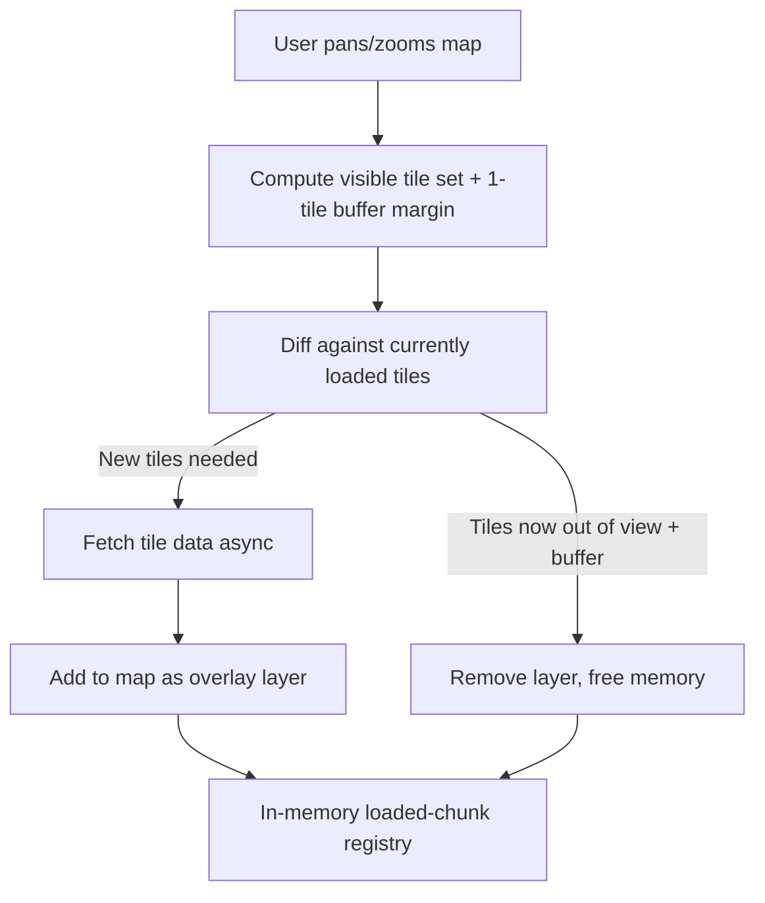
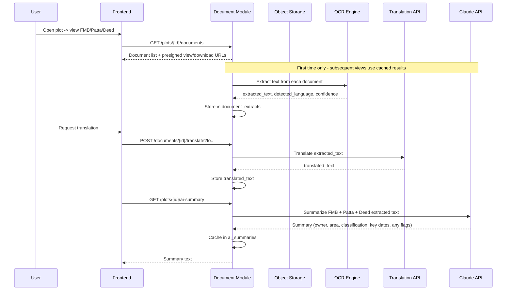
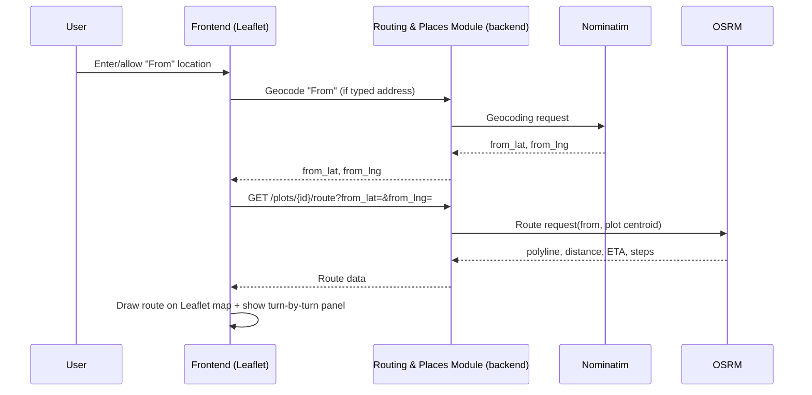

# Land Portfolio Management System (LPMS)

**Technical Design, Architecture & Implementation Document**

**Document type:** System design & implementation blueprint
**Based on:** Product walkthrough (drill-down map navigation, 3-button home screen, document + AI + routing features)

---

## 0. Framing This Correctly

The two earlier reference documents (Technical Approach + Implementation Guide) describe a **public/government cadastral LMS** — multi-jurisdiction, citizen self-service, officer approval workflows. What you've described is a **different product**: an internal tool for an owner/company to manage and explore *their own* land holdings worldwide, with a map-first drill-down UX, document intelligence (OCR + AI summary), and Google-Maps-style navigation to each plot (built on Leaflet + open-source routing/geocoding).

This document is written fresh around your actual spec, but reuses the parts of the earlier docs that still apply well: PostGIS for spatial storage, presigned-URL document storage, RBAC + audit logging, and a modular-monolith-first build strategy.

### Assumptions I'm making — flag any that are wrong before we build:

1. This is a single organization/family's internal portfolio tool, not a multi-tenant SaaS for many landowners (auth = internal users, not public citizens).
2. Plots are supplied to the system as **KML files** (by staff/surveyors), not drawn from scratch by public users.
3. "Land View" (update) and "Land Info" (OCR/detailed doc view) are permission-gated versions of similar data, not entirely separate datasets.
4. FMB, Patta, and Deed are always PDF/image documents per plot.
5. Overseas plots skip the district level (Country → Plots directly), since you only mentioned Country for overseas vs State → District for India.
6. **Day 1 scope**: full coverage of India (all states + all districts, boundary hierarchy fully preloaded) is required at launch. Overseas coverage is added country-by-country, gated by whether free boundary/imagery data exists for that country.
7. **Mobile is a later phase**, not part of the initial build — web only for MVP.

---

## 1. Navigation & UX Flow



This single drill-down pattern (World → India/Overseas → State/Country → District → Plot) is shared by all three buttons — only the permissions and the panel shown at the plot level differ. Building one reusable "Geo Explorer" component that all three buttons launch (with a mode flag) avoids building the map three times.

---

## 2. Feature Specifications

### 2.1 The Interactive Map (shared requirement across all buttons)

| Requirement | Implementation |
|---|---|
| Zoom in/out | Native to Leaflet (`L.map` scroll/pinch/button zoom) |
| Pan / drag to scroll | Native to Leaflet |
| Go to different locations | `map.setView()` / `map.fitBounds()` on selection from lists or search |
| Country/state boundaries visible | Base tile layer's own political lines (OpenStreetMap normal layer shows these) **plus** our own boundary polygons overlaid via `L.geoJSON` / `Leaflet.VectorGrid` for click-to-select and highlighting (see §5) |
| Map types: normal, terrain, satellite | Multiple `L.tileLayer` sources swapped via a layer-switcher control (`L.control.layers`) — see below |

**Map library decision: Leaflet.** Leaflet is the base map renderer — lightweight, open-source, plugin-rich, and it keeps us free of per-map-load billing and Google's terms-of-service requirement that Google-sourced routing/places data be displayed only on a Google map. Paired with Leaflet, each requirement maps to an open data/service source:

| Need | Source used with Leaflet | Notes |
|---|---|---|
| Normal map layer | OpenStreetMap tiles (`L.tileLayer` from an OSM tile server) | Free, shows roads + political boundaries |
| Terrain layer | OpenTopoMap tiles | Free tile source, swappable via layer control |
| Satellite layer | Esri World Imagery tiles (free tier) | Global coverage; if usage grows past Esri's free-tier limits, swap in a paid satellite tile source (e.g. Mapbox Satellite) — same `L.tileLayer` call, one config change |
| Hybrid (satellite + labels) | Esri World Imagery + an OSM label overlay stacked on top | Two `L.tileLayer`s in the same layer group |
| Plot/boundary rendering | `L.geoJSON` (converted server-side from the stored PostGIS/KML geometry) for full-detail zoom; `Leaflet.VectorGrid` for the streamed MVT tiles at lower zoom (§5.1) | Keeps the same tile-streaming backend design regardless of basemap library |
| Drawing tools (future: manual boundary correction) | `Leaflet.draw` | Only needed if we ever let staff hand-edit a boundary in-browser |
| Routing ("from" → plot) | **OSRM** (Open Source Routing Machine) via the `Leaflet Routing Machine` plugin | Self-hosted for production reliability/volume; public demo server fine for early dev only |
| Geocoding (typed "from" address → coordinates) | **Nominatim** (OSM-based geocoder) | Free; self-host if query volume grows, to stay within usage policy limits |
| Nearby landmarks | **Overpass API** (queries OpenStreetMap's point-of-interest data around the plot centroid) | Covers schools, hospitals, roads, water bodies, towns, etc. — less exhaustive than a commercial places API in some areas, but sufficient for "nearest landmarks" and has no per-call billing |

**Trade-off to flag honestly:** OSM-derived data (routing, geocoding, places, and even some boundary detail) is community-sourced, so **coverage quality varies by region** — dense/accurate in urban India and major countries, thinner in some rural or less-mapped overseas areas. Where that turns out to be a real gap for a specific plot's region, the same abstraction (all of this sits behind our own `/route`, `/geocode`, `/nearby` backend endpoints, not called directly from the frontend) lets us swap in a paid provider for just that gap without changing the frontend at all.

### 2.2 Button 1 — Land Details

1. World map opens → modal: **India** or **Overseas**.
2. **India** → list of states that have plots → list of districts → list of plots. **Overseas** → list of countries that have plots → list of plots.
3. Selecting a plot:
   - Map flies/zooms to the plot's boundary (`fitBounds` on the plot polygon, drawn from its stored geometry).
   - An info panel/drawer opens showing plot metadata and three documents: **FMB, Patta, Deed** — each viewable inline and downloadable (presigned URL).
   - An **AI-generated summary** of the three documents is shown (see §7).
   - **Route feature**: a "From" field (defaults to the user's current geolocation, or a manually typed/searched address resolved via Nominatim) and a fixed "To" = the plot. Submitting draws the route polyline (via Leaflet Routing Machine, calling our backend's OSRM-backed `/route` endpoint), shows distance/ETA, turn-by-turn steps.
   - **Nearby landmarks**: a toggle-able list/pins for nearby points of interest (towns, roads, water bodies, schools, hospitals) around the plot centroid, sourced from Overpass API via our backend's `/nearby` endpoint.

### 2.3 Button 2 — Land View

Same drill-down and map, but the plot panel is **editable** (permission-gated — see §8):

- Edit plot metadata (name, area, classification).
- Add a new plot (upload KML → ingestion pipeline, §5).
- Transfer ownership (creates an ownership-history record, never overwrites).
- Every change is written to `audit_log`.

### 2.4 Button 3 — Land Info

Same drill-down, but the panel is a **document-intelligence view**:

- Full plot detail: size, deed contents, complete ownership/transfer history, tax records.
- **OCR**: extract raw text from FMB/Patta/Deed scans (many of these are scanned images or regional-language originals).
- **Translation**: translate extracted text to the user's preferred language on demand.
- All extracted/translated text is persisted so OCR/translation only runs once per document, not on every view.

### 2.5 Cross-Cutting: Search

Three explicit search modes, all hitting the same `plots` table with different filters:

1. **By owner name** — searches current + historical `owners.owner_name`.
2. **By region** — searches the `geo_nodes` hierarchy (country/state/district name).
3. **By property name** — searches `plots.property_name`.

Implementation: PostgreSQL `pg_trgm` trigram indexes for fuzzy/partial matching at MVP scale; upgrade path to Elasticsearch/OpenSearch if the portfolio and search volume grow large (see §12).

---

## 3. System Architecture

Following the same reasoning as the reference implementation guide: **start as a modular monolith**, not microservices. This product has a small, well-defined feature set (not multi-department government scale), so a single deployable backend with clean internal module boundaries (`geo/`, `plots/`, `documents/`, `ai/`, `search/`, `auth/`) will get you to a working product far faster, and can still be split into services later if needed.



**Note on the diagram:** routing, geocoding, and nearby-places calls are proxied through our own backend (Routing and Places Module), never called directly from the frontend. This keeps API keys/self-hosted endpoints server-side and means the OSM-based stack can be swapped for a paid provider later without any frontend change.

### Component responsibilities

| Module | Responsibility |
|---|---|
| Auth & RBAC | Login, JWT issuance, role checks (Admin / Editor / Viewer) |
| Geo Hierarchy | Country/State/District tree, boundary polygons, drives the drill-down lists |
| Plot | Plot CRUD, KML ingestion, ownership history, tax records |
| Document | Upload/store/retrieve FMB, Patta, Deed; presigned URLs |
| AI & OCR | Text extraction, translation, AI summary generation, caching results |
| Search | Owner name / region / property name search |
| Routing & Places | Proxies OSRM (routing), Nominatim (geocoding), Overpass (nearby POIs) behind our own API |
| Audit | Immutable log of every create/update/transfer action |

---

## 4. Data Model

`GEO_NODE` is deliberately a **self-referencing recursive table** rather than separate `countries` / `states` / `districts` tables. This is the key design choice that makes both hierarchies (India: Country→State→District, Overseas: Country only) work with one schema, and makes it trivial to add a level later (e.g., a Province level for a specific overseas country) without a migration.

```sql
-- Recursive geographic hierarchy: Country -> State -> District (or Country -> [nothing] for overseas)
CREATE TABLE geo_nodes (
    id UUID PRIMARY KEY DEFAULT gen_random_uuid(),
    parent_id UUID REFERENCES geo_nodes(id),
    level TEXT NOT NULL CHECK (level IN ('COUNTRY','STATE','DISTRICT','PROVINCE','CUSTOM')),
    name TEXT NOT NULL,
    iso_code TEXT,                                 -- e.g. 'IN', 'IN-TN'
    boundary GEOMETRY(MultiPolygon, 4326),         -- full-resolution boundary
    boundary_lod1 GEOMETRY(MultiPolygon, 4326),    -- heavily simplified (country/world view)
    boundary_lod2 GEOMETRY(MultiPolygon, 4326),    -- medium simplified (state/district view)
    has_free_source_data BOOLEAN DEFAULT TRUE,     -- false for overseas countries with no free boundary data
    created_at TIMESTAMPTZ DEFAULT now()
);
CREATE INDEX idx_geo_nodes_parent ON geo_nodes(parent_id);
CREATE INDEX idx_geo_nodes_boundary ON geo_nodes USING GIST(boundary);

-- Plots (leaf-level land parcels, each tied to a geo_node)
CREATE TABLE plots (
    id UUID PRIMARY KEY DEFAULT gen_random_uuid(),
    geo_node_id UUID REFERENCES geo_nodes(id) NOT NULL,   -- District (India) or Country (Overseas)
    property_name TEXT,
    survey_number TEXT,
    plot_number TEXT,
    area_value NUMERIC(12,2),
    area_unit TEXT DEFAULT 'sqm',
    classification TEXT,
    boundary GEOMETRY(Polygon, 4326) NOT NULL,             -- full-resolution, parsed from KML
    boundary_simplified GEOMETRY(Polygon, 4326),           -- precomputed low-vertex version
    centroid GEOMETRY(Point, 4326) GENERATED ALWAYS AS (ST_Centroid(boundary)) STORED,
    tile_cell TEXT,                                         -- precomputed Z/X/Y or geohash cell
    source_file_type TEXT DEFAULT 'KML' CHECK (source_file_type IN ('KML')),
    source_file_key TEXT,                                   -- original KML kept in object storage
    status TEXT DEFAULT 'ACTIVE',
    created_by UUID,
    created_at TIMESTAMPTZ DEFAULT now(),
    updated_at TIMESTAMPTZ DEFAULT now()
);
CREATE INDEX idx_plots_boundary ON plots USING GIST(boundary);
CREATE INDEX idx_plots_geo_node ON plots(geo_node_id);
CREATE INDEX idx_plots_property_name_trgm ON plots USING GIN (property_name gin_trgm_ops);
CREATE INDEX idx_plots_tile_cell ON plots(tile_cell);

-- Ownership (append-only — never UPDATE/DELETE a historical row)
CREATE TABLE owners (
    id UUID PRIMARY KEY DEFAULT gen_random_uuid(),
    plot_id UUID REFERENCES plots(id),
    owner_name TEXT NOT NULL,
    ownership_share NUMERIC(5,2) DEFAULT 100.00,
    is_current BOOLEAN DEFAULT TRUE,
    valid_from DATE NOT NULL,
    valid_to DATE
);
CREATE INDEX idx_owners_name_trgm ON owners USING GIN (owner_name gin_trgm_ops);

-- Documents: FMB, Patta, Deed (metadata only — bytes live in object storage)
CREATE TABLE documents (
    id UUID PRIMARY KEY DEFAULT gen_random_uuid(),
    plot_id UUID REFERENCES plots(id),
    doc_type TEXT CHECK (doc_type IN ('FMB','PATTA','DEED','OTHER')),
    storage_key TEXT NOT NULL,           -- e.g. plots/{plot_id}/{doc_type}/{uuid}.pdf
    original_language TEXT,
    uploaded_by UUID,
    uploaded_at TIMESTAMPTZ DEFAULT now()
);

-- OCR + translation results (cached, generated once per document)
CREATE TABLE document_extracts (
    id UUID PRIMARY KEY DEFAULT gen_random_uuid(),
    document_id UUID REFERENCES documents(id),
    extracted_text TEXT,
    detected_language TEXT,
    translated_text TEXT,
    translated_to TEXT,
    ocr_confidence NUMERIC(5,2),
    created_at TIMESTAMPTZ DEFAULT now()
);

-- AI-generated plot summary (rebuilt when any of its 3 documents change)
CREATE TABLE ai_summaries (
    id UUID PRIMARY KEY DEFAULT gen_random_uuid(),
    plot_id UUID REFERENCES plots(id) UNIQUE,
    summary_text TEXT,
    source_document_ids UUID[],
    generated_at TIMESTAMPTZ DEFAULT now()
);

-- Ownership transfers / plot lifecycle events
CREATE TABLE transactions (
    id UUID PRIMARY KEY DEFAULT gen_random_uuid(),
    plot_id UUID REFERENCES plots(id),
    transaction_type TEXT CHECK (transaction_type IN ('OWNERSHIP_TRANSFER','PLOT_ADDED','PLOT_UPDATED')),
    from_owner_id UUID REFERENCES owners(id),
    to_owner_id UUID REFERENCES owners(id),
    performed_by UUID,
    performed_at TIMESTAMPTZ DEFAULT now(),
    details JSONB
);

-- Tax records per plot
CREATE TABLE tax_records (
    id UUID PRIMARY KEY DEFAULT gen_random_uuid(),
    plot_id UUID REFERENCES plots(id),
    tax_year INT,
    amount_due NUMERIC(12,2),
    amount_paid NUMERIC(12,2) DEFAULT 0,
    status TEXT DEFAULT 'UNPAID' CHECK (status IN ('UNPAID','PARTIAL','PAID'))
);

-- Users & roles
CREATE TABLE users (
    id UUID PRIMARY KEY DEFAULT gen_random_uuid(),
    full_name TEXT NOT NULL,
    email TEXT UNIQUE NOT NULL,
    password_hash TEXT NOT NULL,
    role TEXT NOT NULL CHECK (role IN ('ADMIN','EDITOR','VIEWER')),
    preferred_language TEXT DEFAULT 'en',
    is_active BOOLEAN DEFAULT TRUE,
    created_at TIMESTAMPTZ DEFAULT now()
);

-- Audit log (append-only, hash-chained for tamper-evidence — see §8)
CREATE TABLE audit_log (
    id BIGSERIAL PRIMARY KEY,
    user_id UUID,
    action TEXT NOT NULL,
    resource_type TEXT,
    resource_id UUID,
    payload_delta JSONB,
    prev_hash TEXT,
    row_hash TEXT,
    created_at TIMESTAMPTZ DEFAULT now()
);
```

**Design notes:**

- `geo_nodes.boundary` is optional at country/state level — only needed where you want the region itself highlighted/clickable as a polygon on the map, rather than just listed in a menu.
- `plots.centroid` is a *generated* column — always derivable from the boundary, never stored redundantly.
- Ownership and transactions are append-only, exactly as in the reference doc — this gives you full transfer history for free and makes "Land View" edits auditable without extra work.

---

## 5. KML Ingestion Pipeline

Plots arrive as **KML files**. The ingestion path:

```mermaid
sequenceDiagram
    participant U as User (Editor)
    participant FE as Frontend
    participant PM as Plot Module
    participant GDAL as GDAL/ogr2ogr (KML parser)
    participant DB as PostgreSQL/PostGIS
    participant S3 as Object Storage

    U->>FE: Upload .kml, fill in plot metadata
    FE->>PM: POST /plots (multipart file + metadata)
    PM->>S3: Store original KML (source_file_key)
    PM->>GDAL: ogr2ogr -f PostgreSQL (parse KML, reproject to SRID 4326)
    GDAL-->>PM: Geometry (Polygon)
    PM->>PM: ST_IsValid check; ST_MakeValid if needed
    PM->>PM: Generate boundary_simplified (ST_SimplifyPreserveTopology) + tile_cell
    PM->>DB: INSERT INTO plots (boundary, boundary_simplified, tile_cell, geo_node_id, ...)
    PM->>DB: INSERT INTO audit_log (PLOT_ADDED)
    PM-->>FE: New plot created, map re-centers on it
```

**Key points:**

- **GDAL/`ogr2ogr`** (or `fastkml`/`pykml` for edge cases) parses KML → PostGIS geometry and reprojects to WGS84 (SRID 4326), which is what both PostGIS and Leaflet expect.
- Always run `ST_IsValid` / `ST_MakeValid` on ingested geometry — KML exported from different survey tools commonly has self-intersections or ring-order issues that will silently break spatial queries otherwise.
- The **original KML is kept** in object storage alongside the parsed geometry, so it can always be re-downloaded or re-processed if parsing logic improves later.
- At ingestion time, a **simplified geometry** (`boundary_simplified`, fewer vertices via `ST_SimplifyPreserveTopology`) and a tile cell ID are also precomputed and stored — these are what make the streaming system in §5.1 possible without doing that work at request time.

For **state/country boundary overlays** (the "boundaries between states, countries" requirement): the OpenStreetMap normal tile layer shows political boundaries visually, but for *click-to-select* behavior in the drill-down UI, you need actual boundary polygons to hit-test against. Source these once from a public dataset (Natural Earth for countries, Survey of India/GADM-derived data for Indian states & districts), load them into `geo_nodes.boundary` during setup, and render/highlight them the same way as plots — via `L.geoJSON` overlays on the Leaflet map.

### 5.1 Dynamic Map Loading — Grid-Based Streaming (GTA-style)

This is the right instinct: with all of India (28 states, 8 UTs, ~770 districts) plus a growing number of KML plots on day 1, loading everything into the browser at once doesn't scale and isn't necessary. The same principle GTA uses for its open world — **stream in only what's near the "camera," at a detail level appropriate to distance, and evict what's no longer needed** — maps directly onto a map application:

| GTA concept | Map equivalent |
|---|---|
| World divided into a grid of cells | Map divided into Web Mercator tiles (Z/X/Y scheme — the same one every standard slippy map, including Leaflet, already uses internally) |
| LOD models (low-poly far away, high-poly up close) | `boundary_lod1` (country view) → `boundary_lod2` (state/district view) → full `boundary` (plot-level zoom) |
| Stream assets in as player approaches | Fetch tile data for cells entering the viewport as the user pans/zooms |
| Unload assets far from player | Evict tile data for cells that leave the viewport + a small buffer, freeing browser memory |
| Preload a coarse version of the whole map (minimap) | Preload `boundary_lod1` for **all of India** at app start — small payload, gives instant full-India rendering, detail streams in on top |

**Backend: vector tiles, not full GeoJSON dumps**

- Boundaries (`geo_nodes`) are precomputed into **Mapbox Vector Tiles (MVT)** using `ST_AsMVT`, served from a tile endpoint: `GET /tiles/boundaries/{z}/{x}/{y}`. These are cheap to cache aggressively (CDN, long TTL) since admin boundaries almost never change.
- Plots (`plots`) are served the same way — `GET /tiles/plots/{z}/{x}/{y}` — but with a short cache TTL and cache-busting on write, since plots get added/edited.
- At low zoom (`z`), the tile query selects `boundary_lod1`/`boundary_lod2`; past a zoom threshold (state/district drilled in), it switches to full-resolution `boundary`. This is a simple `CASE` on `z` in the tile-generating query — no separate infrastructure needed.
- On the frontend, these MVT tiles are rendered with `Leaflet.VectorGrid` (the standard Leaflet plugin for consuming MVT/vector tiles), styled per-layer (boundary outlines vs. plot fills) and wired to click events for the drill-down selection.

**Frontend: a chunk manager, same shape as a GTA streaming system**



- On every `moveend`/`zoom_changed` event, compute the set of tiles currently in view plus a small prefetch margin (load one ring of neighboring tiles before the user reaches them, exactly like GTA streaming ahead of the player).
- Maintain a registry of currently-loaded tile layers; diff new-vs-loaded; fetch only what's missing; unmount/evict layers for tiles that fall outside view + margin.
- This applies whether the user is **free-panning** the open map or **drilling down through the menu** (India → State → District → Plot) — a menu selection is just a programmatic `fitBounds()` that triggers the same tile-loading logic as a manual pan.

**"Entirety of India on Day 1"** — how this stays true without loading everything: Preloading *all* state and district boundaries at `boundary_lod1`/`lod2` resolution is a small payload (a few hundred KB to low single-digit MB, simplified geometry compresses well) — so the full India hierarchy is available **instantly** for the drill-down menus and for rendering the whole country's outline the moment the app opens. What's deferred is the **expensive** data: full-resolution district boundaries and individual plot KML geometries, which stream in tile-by-tile only as the user zooms into a specific area. You get full India coverage on day 1 without a slow initial load.

### 5.2 Overseas Coverage — Data Availability Dependent

For overseas countries, boundary and imagery availability varies, so the system needs to degrade gracefully rather than assume uniform data:

| Data need | Free source(s) to try, in order | Fallback if unavailable |
|---|---|---|
| Country outline | Natural Earth (always available, all countries) | — never actually unavailable at country level |
| State/province/district-level admin boundaries | GADM (free for non-commercial use, covers most countries down to 1–2 admin levels), OpenStreetMap boundary relations via Overpass API | If no sub-country data exists, skip straight from Country → Plots (same as the current India-only-has-districts assumption, just generalized) |
| Satellite imagery | Esri World Imagery (free tier, global coverage), Sentinel-2 cloudless as a backup | Doesn't depend on per-country open data — same tile source works everywhere; if usage exceeds the free tier, swap in a paid tile source for just the satellite layer |

`geo_nodes.has_free_source_data` flags this per node so the frontend can quietly hide a boundary-highlight feature for a country where only a flat plot list (no polygon) is available, instead of showing a broken/empty overlay.

---

## 6. Document Management & AI Pipeline



- **Upload**: presigned PUT to S3 directly from the client (bytes never pass through the app server), matching the pattern in the reference doc.
- **OCR**: Google Cloud Vision (or Azure Document Intelligence) for production-quality results on scanned deeds; Tesseract as a free/offline fallback for typed documents. Run as an async job (not blocking the upload response) since OCR on multi-page scans can take several seconds.
- **Translation**: Google Cloud Translation API (or similar), run on-demand per user's preferred language, cached in `translated_text`/`translated_to` so the same translation isn't billed twice.
- **AI summary**: Claude API call over the three documents' extracted text, producing a short structured summary (owner, area, classification, key dates/clauses, anything unusual worth flagging). Cached in `ai_summaries` and only regenerated when a document on that plot changes.
- **Cost/latency control**: both OCR and AI summary results are **generated once, cached forever until invalidated** — never re-run on every page view.

---

## 7. Routing & Nearby Landmarks

| Feature | Service | Notes |
|---|---|---|
| From-location → plot route | **OSRM**, called via our backend's `/route` endpoint, rendered on Leaflet with the **Leaflet Routing Machine** plugin | "From" = current geolocation (`navigator.geolocation` / device GPS) or a typed address resolved via Nominatim. "To" = plot centroid (or nearest road-accessible point, if the centroid itself is off-road). Self-host OSRM with an India road-network extract (plus extracts for overseas countries as they're onboarded) for production reliability. |
| Nearby landmarks | **Overpass API**, called via our backend's `/nearby` endpoint | Query around plot centroid with a radius (e.g. 2–5 km); categorize results (towns, roads, schools, hospitals, water bodies) for a clean list/pin UI. Cache results per plot with a TTL (e.g. 30 days) since landmarks don't change often — avoids hammering the public Overpass endpoint (or a self-hosted one) on every plot view. |



---

## 8. Security, RBAC & Audit

| Role | Land Details (view) | Land View (edit) | Land Info (OCR/detail) | Admin functions |
|---|---|---|---|---|
| Viewer | ✅ | ❌ | ✅ (view only) | ❌ |
| Editor | ✅ | ✅ (edit, add plot, transfer ownership) | ✅ | ❌ |
| Admin | ✅ | ✅ | ✅ | ✅ (user management, config) |

- JWT-based auth; role embedded as a claim; middleware checks role against route/action before hitting a module.
- Every write (plot edit, ownership transfer, new plot, tax update) writes to `audit_log` with a before/after payload delta.
- Start with a **hash-chained Postgres audit table** (cheap, no extra infra) — each row's hash includes the previous row's hash, so retroactive edits are detectable. Only move to a dedicated immutable ledger (e.g. QLDB) if a compliance requirement specifically demands it.
- Documents are retrieved only via short-lived presigned URLs, never public links — RBAC is checked before a URL is issued.

---

## 9. Key API Endpoints

| Method | Endpoint | Purpose |
|---|---|---|
| GET | `/geo-nodes?level=COUNTRY` | List countries with plots (overseas root) |
| GET | `/geo-nodes?parent_id={id}` | Drill down (states under India, districts under a state) |
| GET | `/plots?geo_node_id={id}` | List plots under a district/country |
| GET | `/plots/{id}` | Plot detail |
| GET | `/plots/{id}/geojson` | Plot boundary for map rendering |
| POST | `/plots` | Create plot (KML upload + metadata) |
| PATCH | `/plots/{id}` | Edit plot metadata (Editor+) |
| POST | `/plots/{id}/transfer-ownership` | Record ownership transfer (Editor+) |
| GET | `/plots/{id}/documents` | List FMB/Patta/Deed with view/download URLs |
| POST | `/documents/upload-url` | Get presigned upload URL |
| POST | `/documents/{id}/ocr` | Trigger/fetch OCR extraction |
| POST | `/documents/{id}/translate?to=` | Translate extracted text |
| GET | `/plots/{id}/ai-summary` | Get (or generate) AI summary |
| GET | `/plots/{id}/route?from_lat=&from_lng=` | Directions to plot |
| GET | `/plots/{id}/nearby?radius=` | Nearby landmarks |
| GET | `/search?owner=&region=&property_name=` | Unified search |

---

## 10. Technology Stack Summary

| Layer | Technology | Why |
|---|---|---|
| Web frontend | React + Leaflet (Leaflet.VectorGrid, Leaflet Routing Machine, Leaflet.draw) | Open-source interactive map matching all stated requirements |
| Mobile frontend (later phase) | React Native + a Leaflet-compatible RN map library | Deferred — not part of initial build; same backend/API reused when it happens |
| Backend | Python (FastAPI) | Async-friendly for I/O-heavy GIS/document/AI calls |
| Database | PostgreSQL + PostGIS | Spatial storage/queries, ACID for ownership records |
| Object storage | S3 (or MinIO for self-hosted) | Raw documents, original KML files |
| Geo conversion | GDAL / ogr2ogr, Shapely, Fiona | KML → PostGIS geometry, geometry simplification for LOD |
| Vector tiles | PostGIS ST_AsMVT (or pg_tileserv) + CDN | Grid-based boundary/plot streaming (§5.1) |
| Basemap tiles | OpenStreetMap (normal), OpenTopoMap (terrain), Esri World Imagery (satellite) | Free tile sources, swapped via `L.tileLayer` |
| Routing | OSRM (self-hosted for production) | Turn-by-turn "from → plot" directions |
| Geocoding | Nominatim | Typed address → coordinates |
| Nearby landmarks | Overpass API | POIs around a plot centroid |
| OCR | Google Cloud Vision (primary), Tesseract (fallback/offline) | Scanned deed/patta text extraction |
| Translation | Google Cloud Translation API | Regional-language document translation |
| AI summarization | Claude API | Document summary generation |
| Search | PostgreSQL pg_trgm (MVP) → Elasticsearch/OpenSearch (scale) | Owner/region/property fuzzy search |
| Async jobs | Celery + Redis | OCR, translation, AI summary, routing/places calls run off the request path |
| Auth | JWT + OAuth2 | Role claims in token |
| Containers/CI | Docker + GitHub Actions | Standard dev/prod parity |

---

## 11. Detailed Phase-by-Phase Implementation Plan

Each phase below lists its goal, the concrete work involved, and an exit criteria — what needs to be true before moving to the next phase. Durations are rough sizing for a small focused team (adjust once team size is known); phases are meant to ship to a staging environment with real/realistic data before moving on, not just pass locally.

### Phase 0 — Project Setup (~1 week)

**Goal:** a working skeleton everything else builds on.

- Provision environments: dev → staging → prod.
- Stand up PostgreSQL + PostGIS, S3/MinIO bucket, Redis, base FastAPI project with the module folder structure (`geo/`, `plots/`, `documents/`, `ai/`, `search/`, `auth/`, `routing/`).
- Docker Compose for local dev; GitHub Actions skeleton (lint + test on push).
- Base React app with Leaflet installed and a blank map rendering (OSM tile layer only, no data yet).

**Exit criteria:** a developer can `docker compose up` and see an empty Leaflet map talking to an empty FastAPI backend, both deployed to staging.

### Phase 1 — Foundation: Auth, RBAC & Core Schema (~2 weeks)

**Goal:** users can log in, and the core data model exists.

- `users` table, JWT login/logout, password hashing.
- Role model: Admin / Editor / Viewer, middleware that checks role per route.
- Full core schema from §4 created via migrations (`geo_nodes`, `plots`, `owners`, `documents`, `document_extracts`, `ai_summaries`, `transactions`, `tax_records`, `audit_log`).
- Minimal admin screen: list/create users, assign roles.
- Audit log wired to fire on every write from this point forward (even before other features exist, so the habit/plumbing is in place early).

**Exit criteria:** an Admin can log in, create an Editor and a Viewer account, and role checks correctly block a Viewer from a write endpoint.

### Phase 2 — India Boundary Load (Day-1 target) (~2 weeks)

**Goal:** the entire India hierarchy renders instantly, satisfying the "entirety of India on day 1" requirement.

- Source India state + district boundary polygons (Survey of India-derived or GADM data), load into `geo_nodes` (level = STATE / DISTRICT, parent_id chain up to level = COUNTRY).
- Precompute `boundary_lod1` / `boundary_lod2` via `ST_SimplifyPreserveTopology` for every node.
- Build the `GET /tiles/boundaries/{z}/{x}/{y}` MVT endpoint (`ST_AsMVT`), CDN-cached.
- Frontend: World map with the India/Overseas modal, drill-down list screens (State → District), `Leaflet.VectorGrid` rendering the boundary tiles, click-to-select wired to `fitBounds()`.

**Exit criteria:** opening the app cold-loads the full India state/district outline near-instantly, and every state and district is clickable and correctly drills down, even though no plots exist yet.

### Phase 3 — KML Plot Ingestion & Streaming (~2–3 weeks)

**Goal:** plots can be uploaded and rendered, with the GTA-style streaming system in place.

- `POST /plots` endpoint: KML upload → S3 → GDAL/ogr2ogr parse → `ST_IsValid`/`ST_MakeValid` → `boundary_simplified` + `tile_cell` precompute → row inserted.
- `GET /tiles/plots/{z}/{x}/{y}` MVT endpoint, short-cached with write-triggered invalidation.
- Frontend chunk manager: compute visible-tile-set-plus-buffer on `moveend`/`zoom`, diff against loaded tiles, fetch/evict — wired into the same `Leaflet.VectorGrid` layer approach as boundaries.
- District/Country → Plot list screens, "zoom to plot" (`fitBounds` on the plot's full-resolution boundary).

**Exit criteria:** uploading a batch of real KML plots across a few different districts renders correctly at every zoom level, and panning around a district with many plots stays smooth (chunk manager visibly loading/evicting, checkable in devtools network tab).

### Phase 4 — Document Management (~1.5 weeks)

**Goal:** FMB, Patta, Deed can be attached to a plot and retrieved securely.

- Presigned-upload flow for documents (`POST /documents/upload-url` → client uploads to S3 → confirm → metadata row).
- Presigned-download/view flow with RBAC check before URL issuance.
- Plot detail panel UI: three document slots (FMB/Patta/Deed), inline preview + download button.

**Exit criteria:** an Editor can attach all three document types to a plot; a Viewer can view/download them but not replace them; a document is never reachable via a raw/public URL.

### Phase 5 — AI, OCR & Translation Layer (~2–3 weeks)

**Goal:** the "AI summary" and document-intelligence features from Land Details/Land Info work end to end.

- OCR job (Celery task) triggered on document upload confirmation → stores `document_extracts`.
- Translation endpoint, on-demand, cached per target language.
- AI summary generation (Claude API call over the plot's three documents' extracted text) → cached in `ai_summaries`, invalidated when a document changes.
- Land Info panel UI: full document text (OCR'd), translate button, summary card.

**Exit criteria:** for a plot with all three documents uploaded, the AI summary and OCR text are visible and correct within a reasonable processing time, and re-opening the same plot doesn't re-trigger OCR/AI calls (cache hit, verifiable in logs).

### Phase 6 — Routing & Nearby Landmarks (~2 weeks)

**Goal:** the Google-Maps-style "from → plot" and "nearby landmarks" features work on Leaflet.

- Stand up OSRM (start with a public/demo instance for dev, move to self-hosted with an India extract before staging sign-off) and Nominatim.
- Backend `/route` and `/geocode` endpoints proxying OSRM/Nominatim.
- Backend `/nearby` endpoint proxying Overpass API, with response caching (TTL) per plot.
- Frontend: "From" input (geolocation or address autocomplete via Nominatim), route drawn via Leaflet Routing Machine, nearby-landmarks toggle with categorized pins/list.

**Exit criteria:** routing from a real address to a real plot produces a sane route/ETA, and nearby landmarks return a reasonable, categorized list for at least a few test plots in different regions.

### Phase 7 — Land View: Editing & Ownership Transfer (~2 weeks)

**Goal:** the "update" side of the product (Button 2) is fully functional.

- Edit-plot form (metadata, classification) — Editor+ only.
- Ownership transfer workflow: creates a new `owners` row, marks the old one `is_current = false`, writes a `transactions` row.
- All of the above writes to `audit_log` with before/after payload.
- Add-new-plot flow reuses the Phase 3 ingestion pipeline behind the Land View button.

**Exit criteria:** an Editor can transfer ownership of a real plot and see the change reflected immediately, with the prior owner still visible in history and an audit entry recorded.

### Phase 8 — Search (~1 week)

**Goal:** the three explicit search modes work.

- `pg_trgm` indexes on `owners.owner_name`, `plots.property_name`, and `geo_nodes.name`.
- `GET /search?owner=&region=&property_name=` endpoint, combining/ranking results.
- Search UI (top-level, accessible from all three buttons) that jumps straight to the matched plot on the map.

**Exit criteria:** searching a partial owner name, a district/state name, or a partial property name reliably surfaces the right plot(s) within acceptable latency.

### Phase 9 — Overseas Rollout (ongoing, country-by-country)

**Goal:** extend beyond India, gated by real data availability per §5.2.

- Per target country: check GADM/OSM coverage for sub-country boundaries; load `geo_nodes` for that country (flat if no sub-levels available, `has_free_source_data = false` where applicable); confirm OSRM/Nominatim/Overpass usable coverage for that region.
- Reuse the exact same plot ingestion, document, AI, and routing pipelines — no new backend logic needed, only data onboarding per country.

**Exit criteria:** each newly onboarded country's plots behave identically to India's in the UI, or gracefully degrade (flat list, no boundary highlight) where source data doesn't exist.

### Phase 10 — Hardening & Launch Readiness (~2 weeks)

**Goal:** production-ready.

- Load test the tile endpoints and chunk-manager behavior under a realistic plot count.
- Confirm OSRM/Nominatim self-hosted capacity matches expected concurrent usage.
- Backups: PostgreSQL PITR, S3 cross-region replication, restore drill.
- Monitoring/alerting (basic: error rates, job queue depth, tile endpoint latency).
